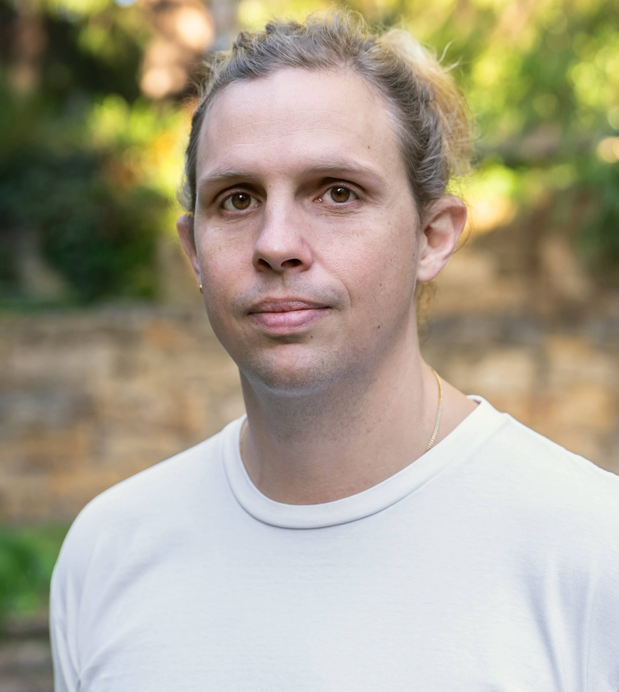

```{=html}
<section class="hero">
  <div class="hero-text">
    <p class="kicker">Lecturer in Statistics · UNSW Sydney</p>
    <h1 class="hero-name">Lachlan Astfalck</h1>
    <p class="hero-role">Spatial and spectral statistics, uncertainty
    quantification — and a lot of applied work in <em>water</em>.</p>
    <div class="hero-social">
      <a class="ftlink" href="https://github.com/astfalckl">
        <svg viewBox="0 0 16 16" fill="currentColor" aria-hidden="true"><path d="M8 0C3.58 0 0 3.58 0 8c0 3.54 2.29 6.53 5.47 7.59.4.07.55-.17.55-.38 0-.19-.01-.82-.01-1.49-2.01.37-2.53-.49-2.69-.94-.09-.23-.48-.94-.82-1.13-.28-.15-.68-.52-.01-.53.63-.01 1.08.58 1.23.82.72 1.21 1.87.87 2.33.66.07-.52.28-.87.51-1.07-1.78-.2-3.64-.89-3.64-3.95 0-.87.31-1.59.82-2.15-.08-.2-.36-1.02.08-2.12 0 0 .67-.21 2.2.82.64-.18 1.32-.27 2-.27s1.36.09 2 .27c1.53-1.04 2.2-.82 2.2-.82.44 1.1.16 1.92.08 2.12.51.56.82 1.27.82 2.15 0 3.07-1.87 3.75-3.65 3.95.29.25.54.73.54 1.48 0 1.07-.01 1.93-.01 2.2 0 .21.15.46.55.38A8.01 8.01 0 0 0 16 8c0-4.42-3.58-8-8-8z"/></svg>
        GitHub</a>
      <a class="ftlink" href="https://scholar.google.com/citations?user=duQ38MgAAAAJ&hl=en&oi=ao">
        <svg viewBox="0 0 24 24" fill="none" stroke="currentColor" stroke-width="1.75" stroke-linecap="round" stroke-linejoin="round" aria-hidden="true"><path d="M21.42 10.922a1 1 0 0 0-.019-1.838L12.83 5.18a2 2 0 0 0-1.66 0L2.6 9.08a1 1 0 0 0 0 1.832l8.57 3.908a2 2 0 0 0 1.66 0z"/><path d="M22 10v6"/><path d="M6 12.5V16a6 3 0 0 0 12 0v-3.5"/></svg>
        Scholar</a>
      <a class="ftlink" href="mailto:l.astfalck@unsw.edu.au">
        <svg viewBox="0 0 24 24" fill="none" stroke="currentColor" stroke-width="1.75" stroke-linecap="round" stroke-linejoin="round" aria-hidden="true"><rect width="20" height="16" x="2" y="4" rx="2"/><path d="m22 7-8.97 5.7a1.94 1.94 0 0 1-2.06 0L2 7"/></svg>
        Email</a>
      <a class="ftlink" href="astfalck_cv.pdf">
        <svg viewBox="0 0 24 24" fill="none" stroke="currentColor" stroke-width="1.75" stroke-linecap="round" stroke-linejoin="round" aria-hidden="true"><path d="M15 2H6a2 2 0 0 0-2 2v16a2 2 0 0 0 2 2h12a2 2 0 0 0 2-2V7Z"/><path d="M14 2v4a2 2 0 0 0 2 2h4"/><path d="M10 9H8"/><path d="M16 13H8"/><path d="M16 17H8"/></svg>
        CV</a>
    </div>
  </div>
  
</section>
```

## About

I'm a Lecturer in Statistics at the University of New South Wales, with
interest in both methodological and applied research. On the methods side:
spectral analysis, complex spatio-temporal data, emulation of engineering
computer models, and many aspects of uncertainty quantification. I also like
water — I do lots of applied work in oceanography, glaciology and
hydrodynamics.

Previously I was a Research Fellow for the TIDE ARC ITRH in the School of
Physics, Mathematics and Computing at The University of Western Australia, and
a Research Fellow in the School of Earth and Environment at the University of
Leeds. I've also worked in ecological restoration, materials engineering, and
prognostics and health management, and consulted for the Australian Wildlife
Conservancy.

## Selected research

::: {.pubs}
**LC Astfalck**, AM Sykulski and EJ Cripps (2024). 'Debiasing Welch's Method
for Spectral Density Estimation'. *Biometrika*, 111(4), 1313–1329.
[paper](https://academic.oup.com/biomet/article/111/4/1313/7703280)

**LC Astfalck**, DB Williamson, N Gandy, LJ Gregoire and RF Ivanovic (2024).
'Coexchangeable Process Modeling for Uncertainty Quantification in Joint
Climate Reconstruction'. *Journal of the American Statistical Association*,
119(547), 1751–1764.
[paper](https://www.tandfonline.com/doi/full/10.1080/01621459.2024.2325705)

**LC Astfalck**, AM Sykulski and EJ Cripps (2025). 'Bias Correction of
Quadratic Spectral Estimators'. *Biometrika*, asaf033.
[paper](https://academic.oup.com/biomet/advance-article/doi/10.1093/biomet/asaf033/8121249)

R Ou, **LC Astfalck**, D Sen and DB Dunson (2026). 'Scalable Bayesian
inference for time series via divide-and-conquer'. Accepted (minor revisions),
*Journal of the American Statistical Association*.
[preprint](https://arxiv.org/pdf/2106.11043)

**LC Astfalck**, D Sen, S Patra, EJ Cripps and DB Dunson (2025). 'Posterior
Projection for Inference in Constrained Spaces'. Submitted to the *SIAM/ASA
Journal on Uncertainty Quantification*.
[preprint](https://arxiv.org/abs/1812.05741)
:::

## Contact

Please contact me via email, I very seldom check any social media channels,
including LinkedIn. I am accepting research students in statistics and
oceanography, don't be shy in reaching out.
